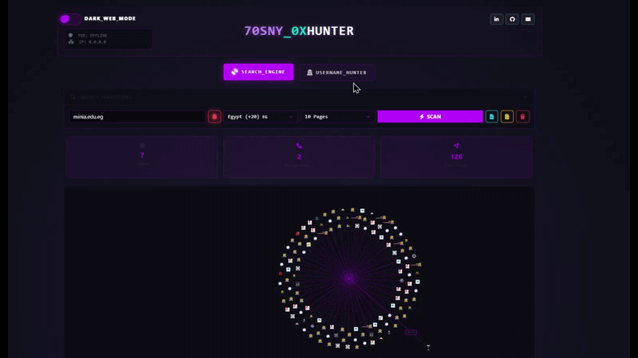

# Project: 70SNY_0XHUNTER (v1.0-stable)
**Advanced OSINT Framework for Digital Identity Correlation & Dark Web Reconnaissance**

### 🤖 Access the Tool
To use this tool, please access our official Telegram bot: 
[**@Oxhunter_h0sny_bot**](https://t.me/YourBotLink)

## 1. Overview
`70SNY_0XHUNTER` is a high-speed OSINT (Open Source Intelligence) engine designed for automated username auditing across 28+ global social platforms and specialized Dark Web directories. The tool facilitates rapid digital footprint mapping by verifying account existence through asynchronous request handling and real-time data streaming.

## 2. Technical Specifications
* **Architecture:** Decoupled Client-Server model.
* **Backend Engine:** Python 3.x / Flask utilizing **Multi-Threading** for concurrent I/O operations.
* **Frontend Controller:** Asynchronous Vanilla JavaScript (ES6+) with stream-reading capabilities.
* **Logic:** * Implements **Bypass Techniques** for Bot Detection and anti-scraping mechanisms.
    * Extended support for specific **Dark Web** entry points to track anonymized aliases.
    * Real-time UI synchronization via a dynamic "Scanning Wave" state machine.

## 3. Core Functionalities
* **Threaded Execution:** Concurrent scanning of multiple targets to minimize latency.
* **Live Status Streaming:** Incremental data transmission allowing immediate result rendering without batch delays.
* **Heuristic Analysis:** Accurate classification of status codes (200 OK vs. 404/Redirect) to prevent false positives.
* **Integrated Recon:** Coverage includes mainstream social media, developer platforms, and deep-web repositories.

## 4. Repository Metadata
* **Access Level:** **Private**. Contains proprietary request headers and bypass logic.
* **Author:** 70SNY_0xHUNTER
* **Environment:** Compatible with Linux/Unix/Windows environments.

## 5. Visual Documentation


## 6. Deployment & Dependencies
To initialize the environment, refer to the `requirements.txt` file for the necessary library stack:
```bash
pip install -r requirements.txt
python app.py
```
## 7. Contact & Network
For technical inquiries, hosting partnerships, or authorized access requests:

LinkedIn: [Mohamed Hosny](https://www.linkedin.com/in/mohamed-hosny-1a2478352/)

Telegram: @M0_H0SNY

Lead Dev: 70SNY_0xHUNTER
